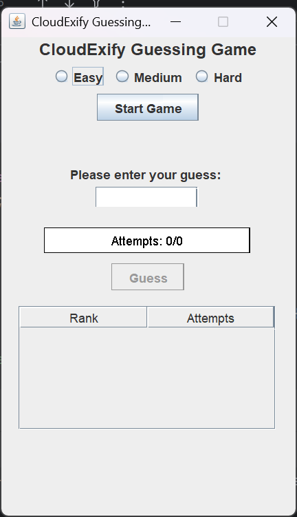
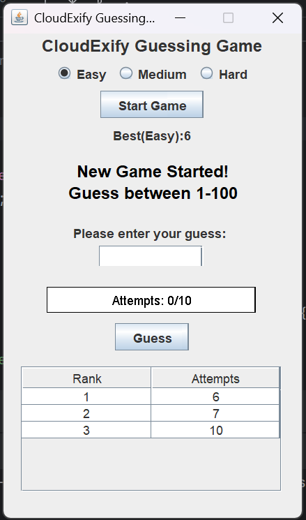

# CloudExify Guessing Game

A desktop **number-guessing game** built with **Java Swing**. Pick a difficulty,
try to find the secret number within a limited number of attempts, and get
"higher / lower" plus **warmer / colder** hints along the way. Your best scores
are saved between sessions and shown on a per-difficulty leaderboard.

---

## Features

- **Three difficulty levels** with their own range and attempt budget:
  | Difficulty | Number Range | Max Attempts |
  |------------|:------------:|:------------:|
  | Easy       | 1 – 100      | 10           |
  | Medium     | 1 – 500      | 15           |
  | Hard       | 1 – 1000     | 20           |
- **Smart hints** — tells you if your guess is too `HIGHER` or `LOWER`, and
  whether you're getting `(Warmer)` or `(Colder)` compared to your last guess.
- **Attempt bar** — a custom-drawn progress bar that turns green → yellow → red
  as you approach the attempt limit.
- **Persistent leaderboard** — the top 5 scores (fewest attempts) for each
  difficulty are saved to `bestscore.txt` and reloaded on startup.
- **Best-score display** for the selected difficulty.
- **Input validation** — rejects non-numeric input and out-of-range guesses.
- **Confirmation dialogs** for restarting a game in progress and for exiting.

---

## Requirements

- **Java Development Kit (JDK) 21 or newer** (the code uses `List.getFirst()` /
  `List.removeLast()`, introduced in Java 21).

Check your version with:

```bash
java -version
```

---

## Getting Started

### Run from the command line

From the project root:

```bash
# Compile
javac -d out src/Game.java

# Run
java -cp out Game
```

> **Note:** Run the game from the project root so it can read and write
> `bestscore.txt` in the current working directory.

### Run from IntelliJ IDEA

1. Open the project folder in IntelliJ IDEA.
2. Open `src/Game.java`.
3. Click the **Run** ▶ icon in the gutter next to the `main` method.

---

## How to Play

1. Select a difficulty: **Easy**, **Medium**, or **Hard**.
2. Click **Start Game**.
3. Type a number into the guess field and click **Guess**.
4. Use the hints to close in on the secret number:
   - `HIGHER~` — the secret number is higher than your guess.
   - `LOWER~` — the secret number is lower than your guess.
   - `(Warmer)` / `(Colder)` — you're closer to / further from the number than
     your previous guess.
5. Guess it before your attempts run out! When you win, you're prompted to play
   again, and your score is recorded on the leaderboard.

---

## Project Structure

```
cloudexify-java-p1-rusha/
├── src/
│   └── Game.java          # Entire game (UI + logic + score persistence)
├── Screenshots/           # Gameplay screenshots
├── bestscore.txt          # Saved leaderboard (one line per difficulty)
├── README.md
└── cloudexify-java-p1-rusha.iml
```

### `bestscore.txt` format

Three comma-separated lines — Easy, Medium, and Hard — each holding up to five
attempt counts, sorted best (fewest) first. Example:

```
6,6,7,7,10,


```

The file is created automatically the first time you win a game.

---

## Screenshots

| | |
|---|---|
|  |  |
|  |  |
|  | |

---

## How It Works

The whole game lives in a single class, `Game`:

- The UI is a `JFrame` laid out with `BoxLayout`, containing the difficulty
  radio buttons, guess field, custom `AttemptBar`, and a `JTable` leaderboard.
- `beginRound()` configures the range and attempt limit for the chosen
  difficulty, then `startNewGame()` picks a random secret number.
- `checkGuess()` handles validation, win/lose detection, and the
  higher/lower + warmer/colder hint logic.
- `ScoreEntry` records attempt counts; `addScore()` keeps only the best five per
  difficulty, and `loadBestScores()` / `saveBestScores()` handle persistence.
